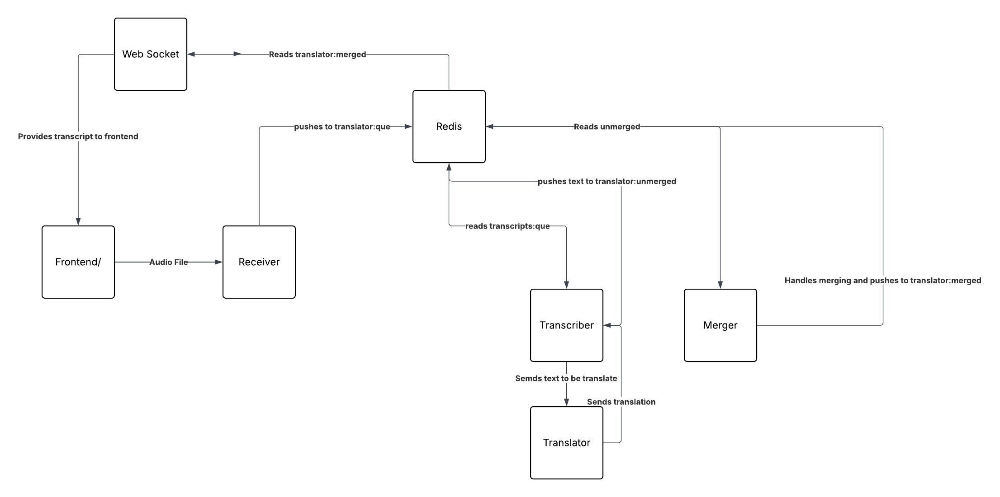

Application Flow:

Backlog
Investigate additional models for language specific transcription/translation
Dockerize each program into its own micro service
Figure out what cloud platforms will acommodate the hardware needs of the application the best
Create a shared volume, such as EFS
Create a server orchestration service